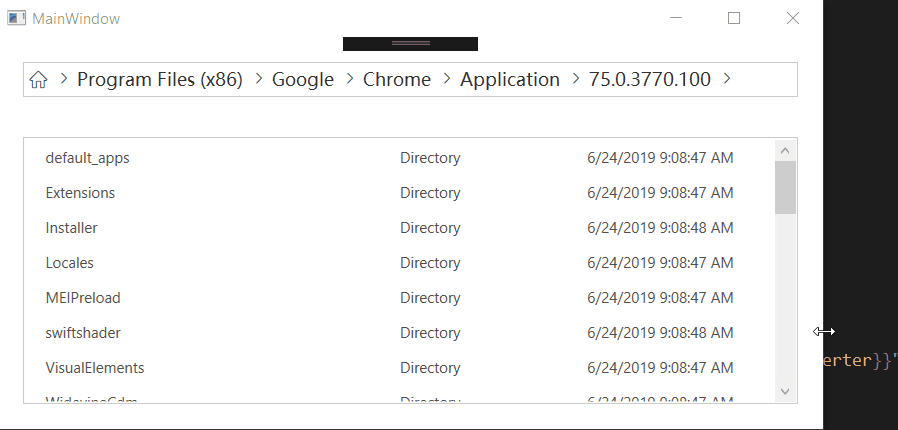

# TreeBreadcrumbControl

A breadcrumb control (WPF) used to display tree structures, which behaves in the same way as the windows file explorer.



## How to use it?

The `TreeBreadcrumb` control has a `CurrentNode` property that accepts an instance of the `ITreeNode<T>` type. First you should implement this interface, and there is a class named `LazyObservableTreeNode` in the `Demo` project, and you can refer to it. 

In addition, the `CurrentNode` property may be changed inside the control, and some operations may be required while changing the `CurrentNode`, such as refreshing its child nodes, so the `CurrentNode` property is not bound by two-way, and its change should be done by the `SetCurrentNodeCommand` property.

```xml
<tbc:TreeBreadcrumb CurrentNode={Binding CurrentNode} 
                    SetCurrentNodeCommand={Binding SetCurrentNodeCommand}/>
```

```csharp
public interface ITreeNode<out T>
{
    T Content { get; }

    ITreeNode<T> Parent { get; }

    IEnumerable<ITreeNode<T>> Children { get; }
}
```